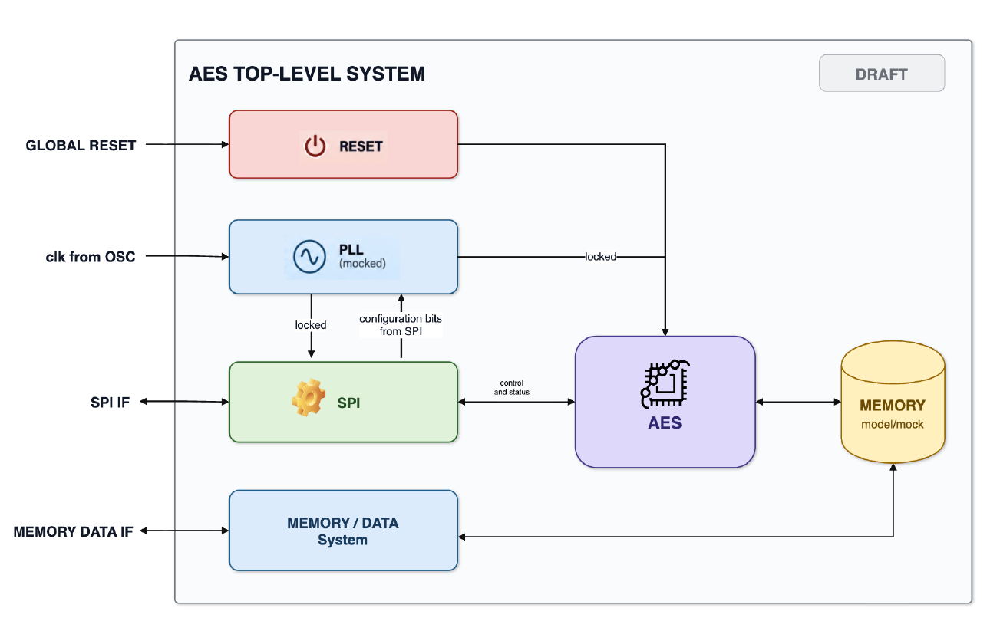
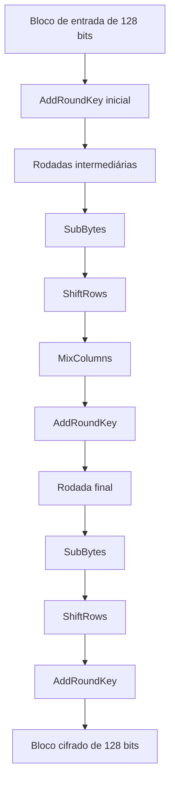
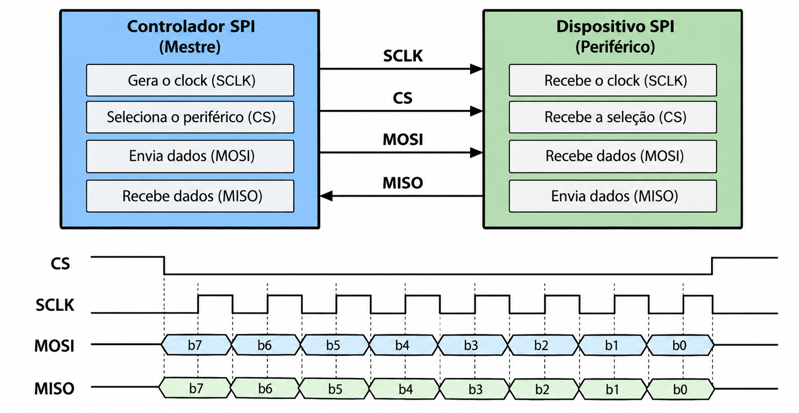

# Estudo introdutório — AES e interface SPI

**Projeto:** Acelerador AES com interface SPI e baixo consumo  
**Trilha:** RTL Design  
**Etapa:** Semana 1 — Estudo e ambiente  
**Responsável:** Joelson Silva de Souza  
**Data:** 09/10/2026

## 1. Introdução

O *Advanced Encryption Standard* (AES) é um padrão de criptografia simétrica adotado pelo NIST em 2001 para substituir o DES. O AES se baseia no algoritmo Rijndael e utiliza uma chave secreta compartilhada para realizar a cifragem e a decifragem. Seu processamento ocorre em blocos de **128 bits**, independentemente do tamanho da chave, que pode ser de 128, 192 ou 256 bits [1].

Neste projeto, o objetivo é desenvolver gradualmente um **acelerador AES descrito em SystemVerilog**, configurado e controlado por uma interface **SPI (*Serial Peripheral Interface*)**. A arquitetura geral inclui, além do núcleo criptográfico, blocos de reset, geração de clock e movimentação de dados com memória. O escopo da **Semana 1** é estudar esses conceitos e preparar o ambiente: **o núcleo AES e a SPI**.

*Figura 1 — Arquitetura-base AES Top-Level System, .*

## 2. Objetivos do estudo

**Objetivo geral.** Compreender o funcionamento conceitual do AES e da comunicação SPI, identificando como ambos serão utilizados na arquitetura de hardware do acelerador.

**Objetivos específicos:**

- Identificar o tamanho dos blocos, as variantes de chave e o número de rodadas do AES.
- Descrever o papel das transformações **SubBytes, ShiftRows, MixColumns** e **AddRoundKey**, sem desenvolver sua fundamentação algébrica.
- Explicar a finalidade da expansão de chave (*key expansion*).
- Identificar os sinais básicos da SPI, as condições de transferência e os modos definidos por CPOL e CPHA.
- Relacionar os conceitos estudados aos módulos previstos para o sistema de topo em RTL.

## 3. Fundamentos do AES

### 3.1. Criptografia simétrica e características

Na criptografia simétrica, emissor e receptor utilizam a mesma chave secreta para cifrar e decifrar os dados. No AES, os dados são tratados em blocos de 128 bits, organizados internamente como **16 bytes** em uma matriz denominada **estado (*state*)**. O algoritmo aplica transformações sucessivas ao estado, controladas por chaves derivadas da chave original [1].

| Variante | Tamanho do bloco | Tamanho da chave | Rodadas |
| --- | --- | --- | --- |
| AES-128 | 128 bits | 128 bits | 10 |
| AES-192 | 128 bits | 192 bits | 12 |
| AES-256 | 128 bits | 256 bits | 14 |

*Tabela 1 — Características das variantes padronizadas do AES [1].*

O aumento do tamanho da chave altera o número de rodadas e os requisitos de implementação. 

### 3.2. Organização do estado

Cada bloco de 128 bits corresponde a 16 bytes. O algoritmo organiza esses bytes em quatro linhas e quatro colunas, preenchidas **por coluna**, conforme o FIPS 197 [1]. Essa disposição importa para implementar corretamente as operações em SystemVerilog.

| Linha | Coluna 0 | Coluna 1 | Coluna 2 | Coluna 3 |
| --- | --- | --- | --- | --- |
| 0 | `b0` | `b4` | `b8` | `b12` |
| 1 | `b1` | `b5` | `b9` | `b13` |
| 2 | `b2` | `b6` | `b10` | `b14` |
| 3 | `b3` | `b7` | `b11` | `b15` |

*Tabela 2 — Representação conceitual do estado AES de 128 bits.*

### 3.3. Etapas das rodadas

O AES inicia o processamento com uma operação **AddRoundKey**. Em seguida, executa rodadas compostas pelas transformações abaixo. **A última rodada não utiliza MixColumns** [1].

*Figura 2 — Sequência conceitual das transformações de cifragem AES. O diagrama apresenta as operações em cada grupo; nas rodadas intermediárias, a sequência se repete pelo número definido na variante [1].*

**SubBytes:** substitui individualmente cada byte do estado por outro valor, consultando uma tabela de substituição conhecida como **S-box**. Introduz uma transformação não linear no processamento.

**ShiftRows:** realiza deslocamentos circulares nas linhas do estado. A primeira permanece na mesma posição; as demais são deslocadas em quantidades diferentes. Essa operação redistribui os bytes entre as colunas.

**MixColumns:** combina os quatro bytes de cada coluna para difundir as informações do estado. A operação pode ser descrita matematicamente no padrão, mas seu papel aqui é compreender a mistura de dados antes da próxima transformação.

**AddRoundKey:** combina o estado com a chave da rodada por meio da operação lógica XOR. É a etapa que incorpora diretamente o material da chave ao processamento.

### 3.4. Expansão de chave

O AES não reutiliza a chave original de maneira idêntica em todas as rodadas. Um procedimento chamado **expansão de chave** (*key expansion* ou *key schedule*) produz as chaves de rodada necessárias ao processamento [1].

Em hardware, essa função poderá ser implementada como lógica específica de geração ou armazenamento das chaves de rodada, conforme a microarquitetura.

## 4. Fundamentos da comunicação SPI

### 4.1. Visão geral

A SPI (*Serial Peripheral Interface*) é uma interface de comunicação serial síncrona utilizada para conectar um controlador a dispositivos periféricos. O controlador fornece o clock e seleciona o periférico; a transferência de dados ocorre em sincronia com esse clock [2, 3].

No contexto deste projeto, o circuito AES atuará como **periférico SPI**, recebendo comandos de configuração e oferecendo informações de controle ou estado. A forma exata dos comandos e dos registradores dependerá da especificação funcional.

*Figura 3 — Conexão básica SPI; figura reproduzida do material de estudo enviado, originalmente associada à nota AN-1248 da Analog Devices [3].*

### 4.2. Sinais principais

| Sinal | Direção no AES periférico | Função |
| --- | --- | --- |
| **SCLK** | Entrada | Clock fornecido pelo controlador para sincronizar as transferências. |
| **CS** / **CS_n** | Entrada | Seleciona o dispositivo; frequentemente ativo em nível baixo. |
| **MOSI** | Entrada | Transporta bits do controlador para o periférico. |
| **MISO** | Saída | Transporta bits do periférico para o controlador. |

*Tabela 3 — Sinais convencionais da SPI de quatro fios [2, 3]. Nomes definitivos e polaridades deverão seguir a especificação de topo.*

Em uma transação típica, o controlador ativa **CS**, gera pulsos em **SCLK** e transmite bits por **MOSI**. Quando há leitura, recebe bits em **MISO**. O protocolo é capaz de operar em *full-duplex*, embora a utilização efetiva dependa do dispositivo e do formato de comando.

### 4.3. Polaridade e fase do clock

Dois parâmetros determinam quais bordas do clock são utilizadas para atualizar e amostrar os dados:

- **CPOL:** estabelece o nível lógico de SCLK em repouso.
- **CPHA:** estabelece se a amostragem ocorre na primeira ou na segunda borda da transferência.

| Modo | CPOL | CPHA | Repouso do SCLK | Borda de amostragem |
| --- | --- | --- | --- | --- |
| 0 | 0 | 0 | Baixo | Subida |
| 1 | 0 | 1 | Baixo | Descida |
| 2 | 1 | 0 | Alto | Descida |
| 3 | 1 | 1 | Alto | Subida |

*Tabela 4 — Convenção usual dos quatro modos SPI [2, 3]. A borda de atualização dos dados é, em geral, a oposta à de amostragem.*

É necessário que os dois lados da comunicação utilizem modos compatíveis. **Ainda não está estabelecido qual modo SPI será exigido para o acelerador**, pois essa escolha depende da especificação funcional do instrutor.

## 5. Relação entre AES, SPI e a arquitetura RTL

A SPI e o AES possuem responsabilidades distintas: **a SPI configura e controla**, enquanto **o núcleo AES processa os blocos de dados**. O sistema proposto inclui também a interface de memória/dados, os circuitos de inicialização e a geração de clock.

A arquitetura apresentada no material do projeto prevê que a lógica de deslocamento e recepção SPI opere no domínio de **SCLK**, enquanto o banco de registradores e o núcleo AES operem no domínio do clock do sistema. Dessa forma, a futura implementação deverá tratar a **travessia entre domínios de clock (CDC)**. Essa definição será detalhada na Semana 2, e a verificação correspondente ocorrerá na integração.

A escolha da microarquitetura — por exemplo, processamento iterativo por rodada — deverá considerar área, latência, frequência e, mais adiante, oportunidades de baixo consumo. **Nenhuma dessas soluções está implementada nesta primeira semana.**

## 6. Síntese do estudo e continuidade

O estudo permitiu identificar os fundamentos necessários para a próxima fase: as operações do AES, os sinais e modos da SPI e as funções gerais de cada bloco do sistema. A Semana 2 será dedicada à definição de arquitetura, interfaces, mapa de registradores e estratégias de clock e reset, a partir da especificação fornecida pelo instrutor.

Este documento registra **o estudo conceitual**, não resultados de uma implementação do núcleo AES. As atividades práticas de configuração do Git, Makefile, Vlogan e VCS são documentadas separadamente em [`semana_01.md`](semana_01.md).

## Referências

[1] NIST. **Advanced Encryption Standard (AES)**. FIPS PUB 197, atualização de 2023. https://doi.org/10.6028/NIST.FIPS.197-upd1

[2] DHAKER, P. **Introduction to SPI Interface**. *Analog Dialogue*, Analog Devices, 2018. https://www.analog.com/en/resources/analog-dialogue/articles/introduction-to-spi-interface.html

[3] USACH, M. **AN-1248: SPI Interface**. Analog Devices, 2015. https://www.analog.com/en/resources/app-notes/an-1248.html

**Nota sobre figuras:** a Figura 1 provém do material de arquitetura fornecido para o projeto; a Figura 3 é reproduzida a partir do PDF de estudo e deve ser mantida com atribuição à Analog Devices. Verifique as condições de reutilização antes de publicar o repositório como público.
